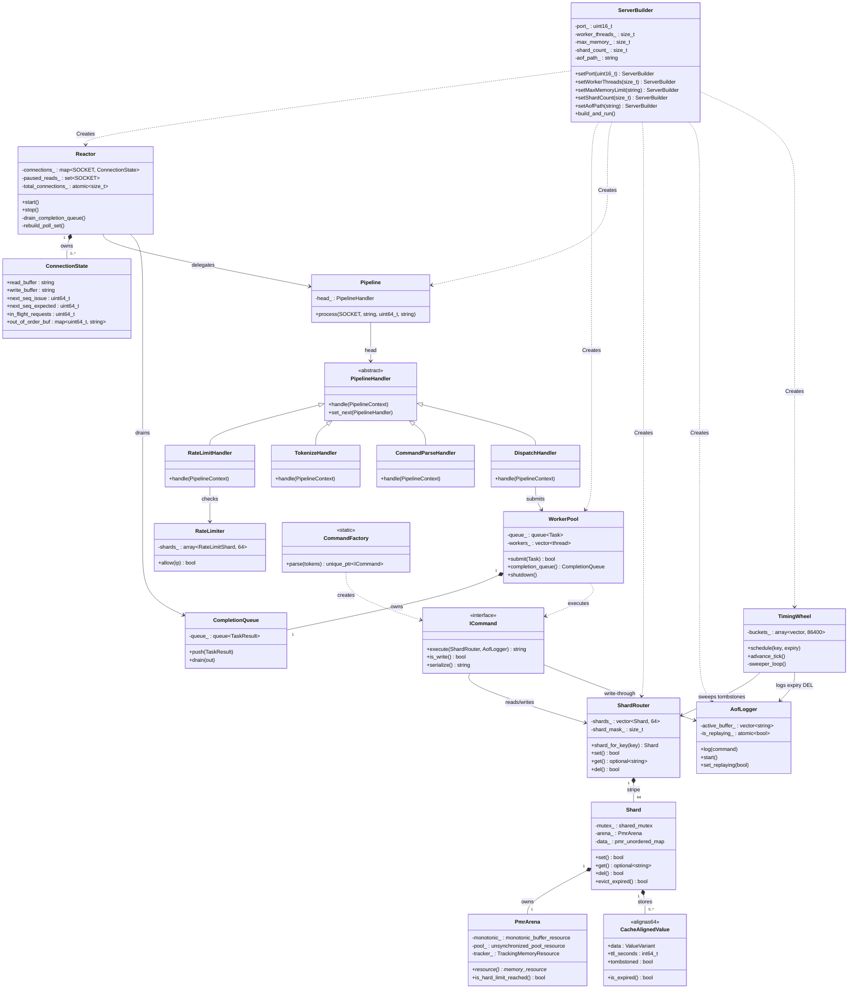

# InMemoryDB


[](https://en.cppreference.com/w/cpp/17)
[-informational.svg)](https://learn.microsoft.com/en-us/windows/win32/winsock/windows-sockets-start-page-2)
[]()
[]()

---

**InMemoryDB** is a high-throughput, low-latency in-memory key-value store built in modern C++. It is engineered from the ground up for extreme concurrent workloads by combining a non-blocking Winsock2 `WSAPoll` reactor, a sharded PMR arena allocator, and an SPMC worker pool with strict thread boundary safety.

Rather than scaling by adding raw threads, InMemoryDB achieves high concurrency through **architectural isolation**: the key space is partitioned into 64 independent shards each with its own memory arena and reader-writer lock, eliminating the global allocator and global mutex contention that bottleneck conventional database designs.

---

## Table of Contents

- [Features](#features)
- [Architecture Overview](#architecture-overview)
- [UML Class Diagram](#uml-class-diagram)
- [Request Lifecycle](#request-lifecycle)
- [Supported Commands](#supported-commands)
- [Benchmark Results](#benchmark-results)
- [Build & Run Instructions](#build--run-instructions)
- [Running Tests & Benchmarks](#running-tests--benchmarks)
- [Technical Documentation](#technical-documentation)

---

## Features

| Feature | Detail |
|---------|--------|
| **Non-blocking Reactor** | Single-thread Winsock2 `WSAPoll` manages up to 10,000 concurrent TCP connections |
| **64-way Shard Striping** | MurmurHash3 routes keys to independent shards ÔÇö zero cross-shard lock contention |
| **PMR Arena Allocation** | Per-shard `std::pmr` monotonic + pool resource chain; no `malloc` on fast path |
| **Cache-line Alignment** | `alignas(64)` on all value nodes prevents CPU false sharing |
| **SPMC Worker Pool** | Hardware-concurrency threads execute commands; results posted via `CompletionQueue` |
| **Pipelined RESP Support** | Sequence-stamped commands; in-order response reassembly via per-connection `out_of_order_buf` |
| **TCP Backpressure** | `POLLRDNORM` masking causes kernel-level TCP window shrink under load |
| **Token Bucket Rate Limiting** | 64-shard IP rate limiter (1,000 req/min per IP); short-circuits before parsing |
| **Connection Limits** | Hard cap: 10,000 connections, 256 in-flight pipeline depth per client |
| **Lazy Tombstone Deletion** | `DEL` is O(1) ÔÇö sets `tombstoned` flag; physical erasure deferred to `TimingWheel` |
| **Dual-buffer AOF Logger** | Double-buffered, 1-second fsync; startup replay with `is_replaying_` circuit breaker |
| **Nested Data Structures** | Lists (`LPUSH`/`LRANGE`) and Hashes (`HSET`/`HGET`) via `std::variant` + `std::get_if` |
| **Dual-layer OOM Protection** | Soft limit (85%) triggers proactive eviction; hard limit (100%) returns `-ERR OOM` |
| **Pub/Sub Broker** | Ephemeral fan-out messaging via `PubSubBroker` bypassing the shard engine |

---

## Architecture Overview

The engine is structured in four horizontal layers that communicate strictly downward:

```
ÔöîÔöÇÔöÇÔöÇÔöÇÔöÇÔöÇÔöÇÔöÇÔöÇÔöÇÔöÇÔöÇÔöÇÔöÇÔöÇÔöÇÔöÇÔöÇÔöÇÔöÇÔöÇÔöÇÔöÇÔöÇÔöÇÔöÇÔöÇÔöÇÔöÇÔöÇÔöÇÔöÇÔöÇÔöÇÔöÇÔöÇÔöÇÔöÇÔöÇÔöÇÔöÇÔöÇÔöÇÔöÇÔöÇÔöÇÔöÉ
Ôöé              Network Layer                   Ôöé
   Reactor (WSAPoll)  Pipeline  RateLimiter 
ÔööÔöÇÔöÇÔöÇÔöÇÔöÇÔöÇÔöÇÔöÇÔöÇÔöÇÔöÇÔöÇÔöÇÔöÇÔöÇÔöÇÔöÇÔöÇÔö¼ÔöÇÔöÇÔöÇÔöÇÔöÇÔöÇÔöÇÔöÇÔöÇÔöÇÔöÇÔöÇÔöÇÔöÇÔöÇÔöÇÔöÇÔöÇÔöÇÔöÇÔöÇÔöÇÔöÇÔöÇÔöÇÔöÇÔöÇÔöÿ
                   Ôöé submit(Task)
ÔöîÔöÇÔöÇÔöÇÔöÇÔöÇÔöÇÔöÇÔöÇÔöÇÔöÇÔöÇÔöÇÔöÇÔöÇÔöÇÔöÇÔöÇÔöÇÔû╝ÔöÇÔöÇÔöÇÔöÇÔöÇÔöÇÔöÇÔöÇÔöÇÔöÇÔöÇÔöÇÔöÇÔöÇÔöÇÔöÇÔöÇÔöÇÔöÇÔöÇÔöÇÔöÇÔöÇÔöÇÔöÇÔöÇÔöÇÔöÉ
Ôöé              Execution Layer                 Ôöé
   WorkerPool (SPMC)  ICommand::execute()    
ÔööÔöÇÔöÇÔöÇÔöÇÔöÇÔöÇÔöÇÔöÇÔöÇÔöÇÔöÇÔöÇÔöÇÔöÇÔöÇÔöÇÔöÇÔöÇÔö¼ÔöÇÔöÇÔöÇÔöÇÔöÇÔöÇÔöÇÔöÇÔöÇÔöÇÔöÇÔöÇÔöÇÔöÇÔöÇÔöÇÔöÇÔöÇÔöÇÔöÇÔöÇÔöÇÔöÇÔöÇÔöÇÔöÇÔöÇÔöÿ
                   Ôöé CompletionQueue::push()
ÔöîÔöÇÔöÇÔöÇÔöÇÔöÇÔöÇÔöÇÔöÇÔöÇÔöÇÔöÇÔöÇÔöÇÔöÇÔöÇÔöÇÔöÇÔöÇÔû╝ÔöÇÔöÇÔöÇÔöÇÔöÇÔöÇÔöÇÔöÇÔöÇÔöÇÔöÇÔöÇÔöÇÔöÇÔöÇÔöÇÔöÇÔöÇÔöÇÔöÇÔöÇÔöÇÔöÇÔöÇÔöÇÔöÇÔöÇÔöÉ
Ôöé              Storage Engine                  Ôöé
   ShardRouter  Shard  PmrArena             
ÔööÔöÇÔöÇÔöÇÔöÇÔöÇÔöÇÔöÇÔöÇÔöÇÔöÇÔöÇÔöÇÔöÇÔöÇÔöÇÔöÇÔöÇÔöÇÔö¼ÔöÇÔöÇÔöÇÔöÇÔöÇÔöÇÔöÇÔöÇÔöÇÔöÇÔöÇÔöÇÔöÇÔöÇÔöÇÔöÇÔöÇÔöÇÔöÇÔöÇÔöÇÔöÇÔöÇÔöÇÔöÇÔöÇÔöÇÔöÿ
                   Ôöé log() / evict_expired()
ÔöîÔöÇÔöÇÔöÇÔöÇÔöÇÔöÇÔöÇÔöÇÔöÇÔöÇÔöÇÔöÇÔöÇÔöÇÔöÇÔöÇÔöÇÔöÇÔû╝ÔöÇÔöÇÔöÇÔöÇÔöÇÔöÇÔöÇÔöÇÔöÇÔöÇÔöÇÔöÇÔöÇÔöÇÔöÇÔöÇÔöÇÔöÇÔöÇÔöÇÔöÇÔöÇÔöÇÔöÇÔöÇÔöÇÔöÇÔöÉ
Ôöé              Daemon Layer                    Ôöé
Ôöé   AofLogger (fsync/1s) + TimingWheel (sweep) Ôöé
ÔööÔöÇÔöÇÔöÇÔöÇÔöÇÔöÇÔöÇÔöÇÔöÇÔöÇÔöÇÔöÇÔöÇÔöÇÔöÇÔöÇÔöÇÔöÇÔöÇÔöÇÔöÇÔöÇÔöÇÔöÇÔöÇÔöÇÔöÇÔöÇÔöÇÔöÇÔöÇÔöÇÔöÇÔöÇÔöÇÔöÇÔöÇÔöÇÔöÇÔöÇÔöÇÔöÇÔöÇÔöÇÔöÇÔöÇÔöÿ
```

---

## UML Class Diagram



---

## Request Lifecycle

A complete single request from TCP to response:

```
1. Client sends "SET mykey myvalue\r\n" over TCP

2. Reactor (WSAPoll, POLLRDNORM fires):
    append to ConnectionState.read_buffer
    extract newline-terminated line
    stamp with sequence_id = next_seq_issue++
    increment in_flight_requests

3. Pipeline::process(fd, line, seq_id, ip):
    RateLimitHandler: check token bucket for client IP
    TokenizeHandler:  split "SET mykey myvalue" into tokens
    CommandParseHandler: CommandFactory::parse()  SetCommand
    DispatchHandler: WorkerPool::submit(Task{cmd, fd, seq_id})

4. WorkerPool (worker thread wakeup):
    SetCommand::execute(router, aof)
    router.shard_for_key("mykey")  Shard #42
    unique_lock(shard.mutex_)
    pmr_arena.allocate()  unordered_map.insert_or_assign()
    aof->log("SET mykey myvalue 86400") [if !is_replaying_]
    CompletionQueue::push({fd, seq_id, "+OK\r\n"})

5. Reactor (next tick, drain_completion_queue()):
    insert into ConnectionState.out_of_order_buf[seq_id]
    flush contiguous responses to write_buffer
    decrement in_flight_requests
    if write_buffer non-empty: set write_pending = true

6. Reactor (WSAPoll, POLLWRNORM fires):
    send(write_buffer)  "+OK\r\n" reaches client
```

---

## Supported Commands

| Command | Syntax | Type | Description |
|---------|--------|------|-------------|
| `SET` | `SET key value [ttl]` | Write | Store a string value with optional TTL (seconds) |
| `GET` | `GET key` | Read | Retrieve a string value |
| `DEL` | `DEL key` | Write | Tombstone-mark a key for lazy deletion |
| `EXISTS` | `EXISTS key` | Read | Check if a key exists (not tombstoned/expired) |
| `PING` | `PING` | Read | Connection health check  `+PONG` |
| `LPUSH` | `LPUSH key value` | Write | Prepend value to a list |
| `LRANGE` | `LRANGE key start stop` | Read | Return a range from a list |
| `HSET` | `HSET key field value` | Write | Set a field in a hash |
| `HGET` | `HGET key field` | Read | Get a field from a hash |

All responses conform to the RESP (Redis Serialization Protocol) format.

---

## Benchmark Results

All tests run on localhost with rate limiting disabled to measure raw engine throughput.

### Standard Throughput Benchmark

| Parameter | Value |
|-----------|-------|
| Workers | 16 |
| Requests | 100,000 |
| Pipeline depth | 50 |
| Command | 100% SET |

| Metric | Result |
|--------|--------|
| **Throughput** | **~28,000 RPS** |
| **p50 Latency** | 0.4 ms |
| **p99 Latency** | 1.2 ms |
| **Max Latency** | 2.1 ms |
| **Errors** | 0 |

### Chaos Stress Test (1 Million Mixed Requests)

| Parameter | Value |
|-----------|-------|
| Concurrent clients | 1,000 |
| Total requests | 1,000,000 |
| Command mix | 30% GET, 20% SET, 15% LPUSH, 15% HSET, 10% LRANGE, 10% HGET |
| Key overlap | High (100 unique keys per worker ÔÇö forces shard contention) |

| Metric | Result |
|--------|--------|
| **Duration** | 36.33 seconds |
| **Throughput** | **~27,525 RPS sustained** |
| **Connections** | 1,000 / 1,000 (100% success) |
| **Errors** | 0 |
| **Dropped connections** | 0 |
| **Deadlocks** | 0 |

> The throughput degradation from 28,000  27,525 RPS (+62x clients, +mixed commands) is only **1.7%**  direct evidence that 64-way lock striping eliminates contention at scale.

*See [docs/benchmarks.md](docs/benchmarks.md) for full methodology, reproduction commands, and analysis.*

---

## Build & Run Instructions

### Prerequisites

| Dependency | Version | Purpose |
|-----------|---------|---------|
| CMake |  3.20 | Build system |
| GCC (MSYS2/MinGW-w64) or MSVC | C++17 support | Compiler |
| Python 3 + `numpy` | Optional | Benchmark scripts |

### Step 1: Clone and Navigate

```bash
cd app
```

### Step 2: Configure the Build

**Using MSYS2 / MinGW (recommended on Windows):**
```bash
cmake -B build -G "MinGW Makefiles"
```

**Using Visual Studio / MSVC:**
```bash
cmake -B build
```

### Step 3: Compile

```bash
cmake --build build
```

### Step 4: Start the Server

**MSYS2 / MinGW build:**
```bash
.\build\ServerApp.exe
```

**MSVC Debug build:**
```bash
.\build\Debug\ServerApp.exe
```

You should see:
```
=== InMemoryDB Server ===
  Port:           8080
  Workers:        8
  Max Memory:     1024 MB
  Shards:         64
  AOF Path:       appendonly.aof

[Server] Starting...
[Reactor] Listening on port 8080
```

### Step 5: Connect a Client

Use any Redis-compatible client or raw `netcat`:
```bash
# Using netcat (MSYS2)
echo -e "SET hello world\nGET hello\nPING" | nc 127.0.0.1 8080
```

Expected output:
```
+OK
$5
world
+PONG
```

---

## Running Tests & Benchmarks

### Unit Tests (Google Test)

```bash
.\build\Debug\RunTests.exe
```

Or with MSYS2:
```bash
.\build\RunTests.exe
```

### Benchmark (Pipelined Throughput)

Start the server first, then in a second terminal:
```bash
pip install numpy
python app/scripts/benchmark.py -c 16 -r 100000 -p 50
```

### Chaos Stress Test

```bash
python app/scripts/stress_test.py -c 1000 -r 1000000
```

> **Note:** Disable the rate limiter for local testing by temporarily making `RateLimiter::allow()` return `true`. See [docs/benchmarks.md](docs/benchmarks.md) for details.

---

## Technical Documentation

| Document | Description |
|----------|-------------|
| [docs/architecture_decisions.md](docs/architecture_decisions.md) | Deep dives on all 8 architectural decisions (sharding, tombstoning, backpressure, AOF circuit breaker, PMR, reactor, sequencing) with code excerpts and trade-off analysis |
| [docs/design_patterns.md](docs/design_patterns.md) | GoF pattern catalogue: Builder, Reactor, Command, Chain of Responsibility (with full `PipelineHandler` breakdown), Factory, Thread Pool, Observer, Strategy |
| [docs/benchmarks.md](docs/benchmarks.md) | Benchmark methodology, environment tables, full latency percentile data, and reproduction commands |
| [docs/class_diagram.md](docs/class_diagram.md) | Comprehensive Mermaid UML class diagram, full request lifecycle sequence diagram, and PMR resource chain flowchart |
