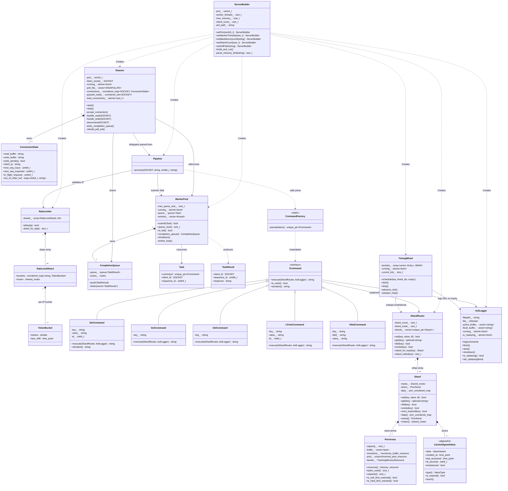
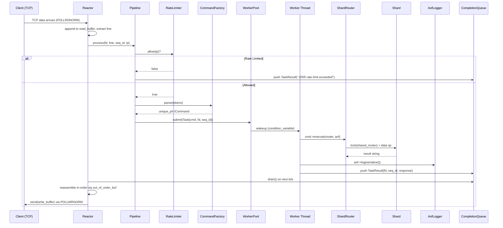
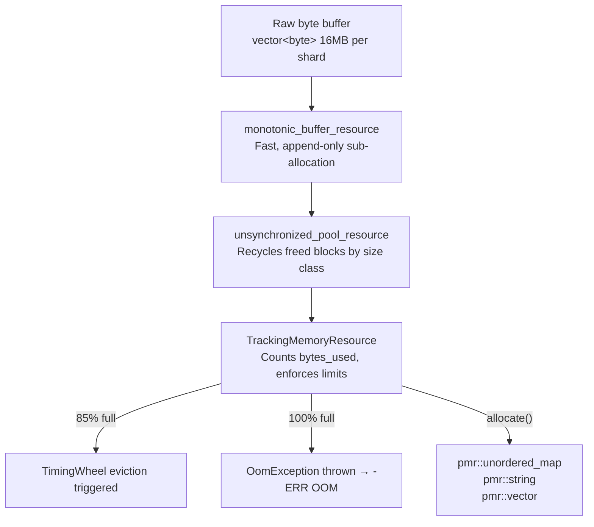

# UML Class Diagram

**Project:** InMemoryDB — High-Throughput C++ Key-Value Store

> This diagram maps the complete class hierarchy, ownership relationships, and data flow of the application from the network layer down to the PMR memory arena.

---

## Full System Class Diagram

---

## Request Lifecycle Flow

---

## Memory Resource Chain

